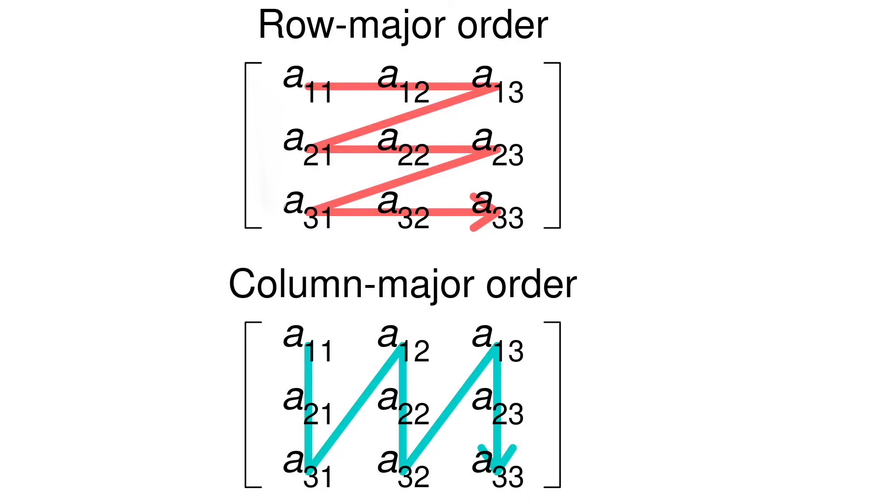

# Vector3D and Matrix3D Classes

## Overview

This code defines two math utility classes: `Vector3D` and `Matrix3D`, which are used for basic 3D vector and matrix operations.

The `Matrix3D` class is implemented using a **column-major** layout, which aligns with how OpenGL expects matrices to be stored in memory.

---

## Class: `Vector3D`

Represents a 3D vector with `x`, `y`, and `z` components. Provides overloaded operators for arithmetic and indexing.

### Example Usage

```cpp
Vector3D a(1.0f, 2.0f, 3.0f);
a *= 2.0f;  // Scales the vector
float x = a[0];  // Accesses 'x' component
```

---

## Class: `Matrix3D`

Represents a 3x3 matrix with a **column-major** memory layout. Internally, the matrix is stored as a 2D array `n[3][3]`, where each inner array corresponds to a **column** of the matrix.

This design allows direct compatibility with OpenGL-style matrix operations, where the matrix is multiplied on the left side of a vector:

```
v' = M * v
```

### Internal Layout

```
n[0] -> column 0 (Vector3D)
n[1] -> column 1 (Vector3D)
n[2] -> column 2 (Vector3D)
```

### Important Notes

- Accessing a column: `matrix[0]` returns the first column as a `Vector3D`.
- Accessing a specific element: `matrix(i, j)` returns the value at row `i`, column `j`.
- The layout may feel inverted if you are used to row-major matrices, such as in DirectX or certain math libraries.

### Example Usage

```cpp
Matrix3D m(
    1.f, 2.f, 3.f,
    4.f, 5.f, 6.f,
    7.f, 8.f, 9.f
);

// Access value at row 0, column 1
float val = m(0, 1);

// Access entire column as Vector3D
Vector3D col = m[1];
```

### Graphic represantion



---

## Compatibility

These classes are particularly well-suited for use in OpenGL environments where column-major matrices are expected. If you are working in a row-major system (e.g., DirectX), you may need to transpose the matrix or adjust indexing logic accordingly.
