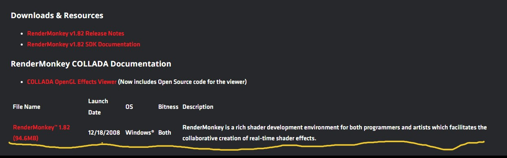

# How to work with the RM_Demos

To work with these file you will need to install the `RenderMonkey 1.82` tool. 

## RenderMonkey 1.82 Installation

To install, please do the following:

1. Download the `RenderMonkey 1.82` from this [link](https://gpuopen.com/archived/rendermonkey-toolsuite/) and install.

2. Go to `File -> Open` and select any of the `rfx` files on the [RM_Demos](../../RM_Demos/) folders.
3. Check them out and start doing any modifications

**Note:** This is only possible on `Windows`.

### Possible issues on Windows 10/11

Since this is a **2008 software**, you might able visualize how the Render Monkey Demo looks.

That being the case you must:
1. Copy the `libGLESv2.dll` and `libES.dll` located on [lib](../../lib/) folder of this project.
2. Paste them on the `RenderMonkey 1.82` root folder. This folder is usually located at `C:\Program Files (x86)\AMD\RenderMonkey 1.82`.
3. Then, go to `File -> Open` and select any of the `rfx` files on the [RM_Demos](../../RM_Demos/) folders.

Eventhough this previews your `rfx` file, `RenderMonkey 1.82` is still unestabled. This means `RenderMonkey 1.82` **will crash** unexpectedly. When you **save** any modifications, **close** the render window, or else.